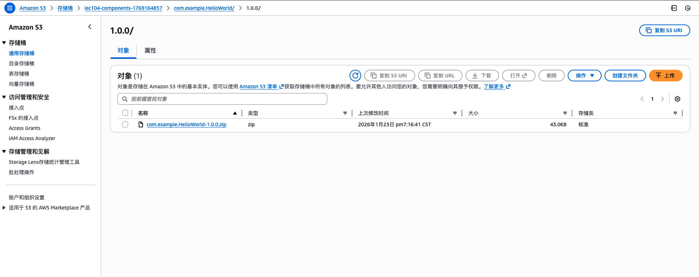
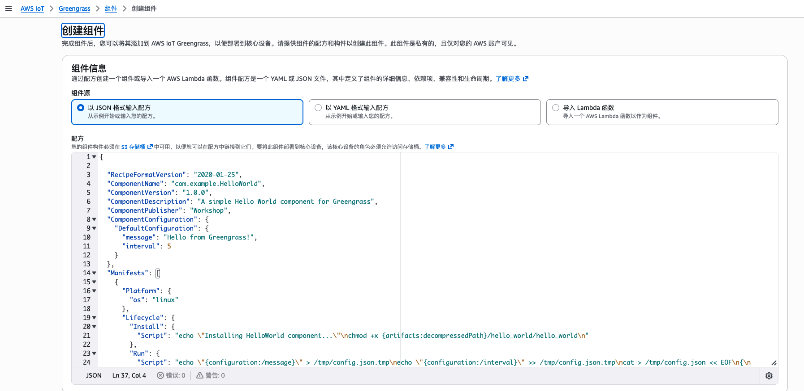
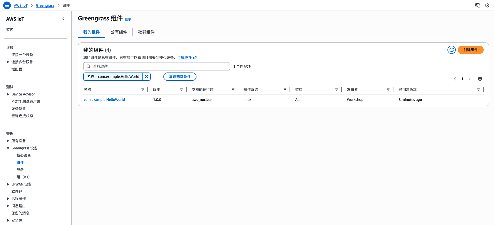
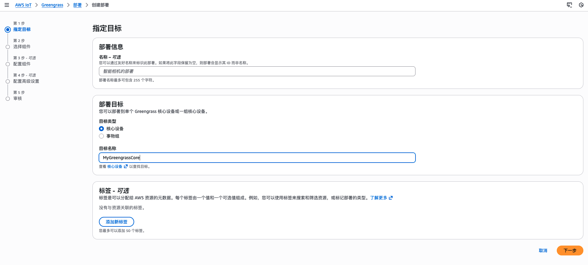
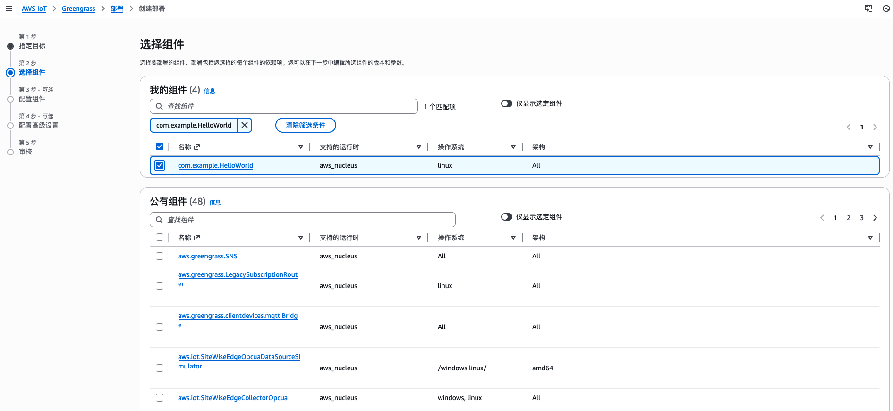
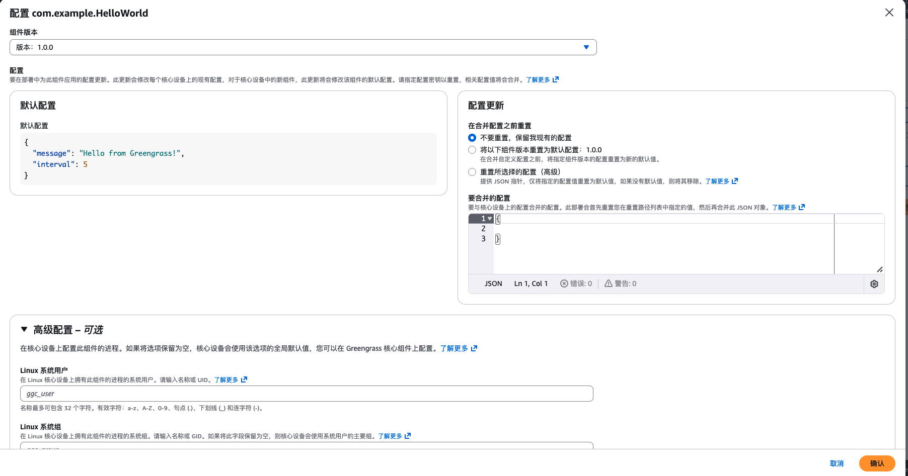
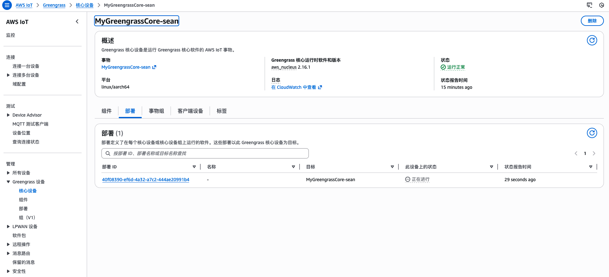

# Lab 1 Workshop 向导: 部署第一个 Greengrass 组件

## 🎯 实验目标

通过本实验,你将学习:
- AWS IoT Greengrass 组件的基本概念和架构
- 如何构建、打包和部署 C++ 组件
- 使用 AWS 管理控制台和 CLI 管理组件
- 动态配置更新机制

**预计时间**: 60 分钟  
**难度级别**: ⭐⭐ 初级

## 📋 前置条件

### 必需环境
- ✅ AWS 账号(具有 IoT 和 Greengrass 权限)
- ✅ 已安装并运行 AWS Greengrass Core v2
- ✅ 已配置 AWS CLI 并设置凭证
- ✅ Linux 环境(Ubuntu 20.04+ 或 Amazon Linux 2)

### 验证环境

```bash
# 检查 Greengrass 状态
sudo systemctl status greengrass

# 检查 AWS CLI
aws sts get-caller-identity

# 检查构建工具
cmake --version
g++ --version
```

### 部署 Greengrass CLI (可选但推荐)

Greengrass CLI 是一个用于本地管理组件的工具,**默认不会自动安装**。

#### 检查是否已安装

```bash
sudo /greengrass/v2/bin/greengrass-cli --version
```

如果提示 `command not found`,需要部署 CLI 组件:

#### 方法 1: 使用 AWS CLI 部署

```bash
# 设置环境变量(如果还没有)
export AWS_REGION="ap-northeast-1"
export THING_NAME="GreengrassQuickStartCore-19be3781cbc"  # 替换为你的 Thing 名称
export ACCOUNT_ID=$(aws sts get-caller-identity --query Account --output text)

# 部署 CLI 组件
aws greengrassv2 create-deployment \
  --target-arn "arn:aws:iot:${AWS_REGION}:${ACCOUNT_ID}:thing/${THING_NAME}" \
  --deployment-name "Deploy-CLI-$(date +%s)" \
  --components '{
    "aws.greengrass.Cli": {
      "componentVersion": "2.12.0"
    }
  }' \
  --region ${AWS_REGION}
```

#### 方法 2: 使用 AWS 控制台部署

1. 打开 [AWS IoT Greengrass 控制台](https://console.aws.amazon.com/iot/home#/greengrass/v2/cores)
2. 选择你的 Core device
3. 点击 **Deploy**
4. 选择 **Public components**
5. 搜索并添加 `aws.greengrass.Cli`
6. 选择版本 `2.12.0` (或最新版本)
7. 点击 **Next** → **Deploy**

#### 等待部署完成 (约 1-2 分钟)

```bash
# 验证安装
sudo /greengrass/v2/bin/greengrass-cli component list
```

#### 如果不部署 CLI

本 Workshop 中所有使用 `greengrass-cli` 的命令都提供了替代方案:

```bash
# 替代方案 1: 查看日志文件
sudo tail -f /greengrass/v2/logs/com.example.HelloWorld.log

# 替代方案 2: 查看所有组件日志
sudo ls -lh /greengrass/v2/logs/

# 替代方案 3: 使用 AWS CLI 查询部署状态
aws greengrassv2 get-deployment \
  --deployment-id <deployment-id> \
  --region ${AWS_REGION}
```

## 🏗️ 架构概览

### 整体架构

```
┌─────────────────────────────────────────────────────────┐
│          AWS IoT Core / Greengrass Cloud                │
│                                                          │
│  ┌──────────────┐         ┌─────────────────┐          │
│  │  S3 Bucket   │         │  Component      │          │
│  │  - Artifacts │◄────────│  Registry       │          │
│  └──────────────┘         └─────────────────┘          │
└────────────────────────────────┬────────────────────────┘
                                 │
                                 │ 1. 部署指令
                                 │ 2. 下载组件
                                 ▼
┌─────────────────────────────────────────────────────────┐
│              Greengrass Core Device                     │
│                                                          │
│  ┌────────────────────────────────────────────────┐    │
│  │  Greengrass Nucleus (核心服务)                 │    │
│  │  - 管理组件生命周期                            │    │
│  │  - 处理配置更新                                │    │
│  │  - 收集日志                                    │    │
│  └──────────────────┬─────────────────────────────┘    │
│                     │                                    │
│                     │ 启动和管理                         │
│                     ▼                                    │
│  ┌────────────────────────────────────────────────┐    │
│  │  com.example.HelloWorld Component              │    │
│  │                                                 │    │
│  │  配置:                                          │    │
│  │  - message: "Hello from Greengrass!"           │    │
│  │  - interval: 5                                 │    │
│  │                                                 │    │
│  │  行为:                                          │    │
│  │  - 每 5 秒打印一次消息                         │    │
│  │  - 响应配置更新                                │    │
│  │  - 优雅关闭                                    │    │
│  └────────────────────────────────────────────────┘    │
│                                                          │
│  日志输出: /greengrass/v2/logs/                         │
└─────────────────────────────────────────────────────────┘
```

### 核心概念

#### 1. Greengrass 组件 (Component)
组件是 Greengrass 的基本部署单元,包含:
- **代码**: 可执行文件、脚本或容器镜像
- **配置**: 运行时参数和设置
- **Recipe**: 定义组件行为的配方文件
- **依赖关系**: 与其他组件的依赖

#### 2. Recipe (配方文件)
Recipe 是组件的"说明书",定义:
- 组件元数据(名称、版本、描述)
- 默认配置
- 生命周期脚本(Install、Run、Shutdown)
- Artifact 位置(S3 URI)
- 平台要求

#### 3. Artifact (制品)
组件的实际文件,存储在 S3:
- 二进制可执行文件
- 脚本文件
- 配置文件
- 依赖库

#### 4. 生命周期管理

| 阶段 | 执行时机 | 典型用途 |
|------|----------|----------|
| **Install** | 首次安装或版本升级 | 设置权限、创建目录、安装依赖 |
| **Run** | 每次启动 | 启动主进程、初始化资源 |
| **Shutdown** | 停止或更新前 | 优雅关闭、清理资源、保存状态 |

### 数据流

```
开发环境                    AWS Cloud                  Greengrass 设备
┌─────────┐               ┌──────────┐               ┌──────────┐
│ 构建组件 │               │          │               │          │
│ 打包 ZIP │  ──上传──>    │ S3 存储  │               │          │
└─────────┘               └────┬─────┘               │          │
                               │                      │          │
┌─────────┐               ┌────▼─────┐               │          │
│ 创建     │               │ 组件注册 │               │          │
│ Recipe  │  ──注册──>    │ (云端)   │               │          │
└─────────┘               └────┬─────┘               │          │
                               │                      │          │
┌─────────┐               ┌────▼─────┐               │          │
│ 创建部署 │  ──部署──>    │ 部署服务 │  ──指令──>    │ Nucleus  │
└─────────┘               └──────────┘               └────┬─────┘
                                                           │
                                                      ┌────▼─────┐
                                                      │ 下载解压 │
                                                      │ 执行组件 │
                                                      └──────────┘
```

## 📁 项目结构

```
lab1-hello-world/
├── src/
│   └── hello_world.cpp      # C++ 源代码
├── CMakeLists.txt            # CMake 构建配置
├── recipe.yaml               # Greengrass 组件配置
├── config.json               # 示例配置文件
├── build.sh                  # 构建脚本
├── package.sh                # 打包脚本
├── deploy.sh                 # 部署脚本
└── test-local.sh             # 本地测试脚本
```


## 🔧 实验步骤

### 步骤 1: 准备实验环境

#### 1.1 进入实验目录

```bash
cd /home/ubuntu/greengrass-iec104-cpp-workshop/lab1-hello-world
```

#### 1.2 确认或者设置环境变量

```bash
# 设置 AWS 区域
export AWS_REGION="ap-northeast-1"  # 根据你的区域修改

# 设置 S3 存储桶名称(如果还没有)
export COMPONENT_BUCKET="iec104-greengrass-components-$(date +%s)"

# 设置 Greengrass Thing 名称(替换为你的实际 Thing 名称)
export THING_NAME="GreengrassQuickStartCore-19be3781cbc"

# 获取账户 ID
export ACCOUNT_ID=$(aws sts get-caller-identity --query Account --output text)

# 验证环境变量
echo "AWS Region: ${AWS_REGION}"
echo "S3 Bucket: ${COMPONENT_BUCKET}"
echo "Thing Name: ${THING_NAME}"
echo "Account ID: ${ACCOUNT_ID}"
```

---

### 步骤 2: 构建组件

#### 2.1 理解构建过程

构建过程将 C++ 源代码编译为可执行二进制文件:

```
源代码 (hello_world.cpp)
  → CMake 配置
  → 编译器 (g++)
  → 链接库 (nlohmann/json, pthread)
  → 二进制文件 (hello_world)
```

#### 2.2 执行构建

```bash
# 使用提供的构建脚本
./build.sh
```

**构建脚本做了什么?**
1. 创建 `build/` 目录
2. 运行 CMake 配置
3. 编译 C++ 代码
4. 生成可执行文件

#### 2.3 验证构建结果

```bash
# 查看生成的二进制文件
ls -lh build/hello_world

# 检查文件类型
file build/hello_world
```

**预期输出**:
```
build/hello_world: ELF 64-bit LSB executable, ARM aarch64, version 1 (SYSV), dynamically linked
```

#### 2.4 本地测试(可选)

在部署到 Greengrass 之前,可以先本地测试:

```bash
# 运行组件
./build/hello_world config.json

# 观察输出,按 Ctrl+C 停止
```

**预期输出**:
```
[INFO] HelloWorld component starting...
[INFO] Configuration loaded from config.json
[INFO] Hello from Greengrass!
[INFO] Component running for 0 seconds
[INFO] Hello from Greengrass!
[INFO] Component running for 5 seconds
```

---

### 步骤 3: 打包组件

#### 3.1 理解打包过程

打包将二进制文件和相关资源打包成 ZIP 文件:

```
build/hello_world
  → 复制到 artifacts/hello_world/
  → 打包成 ZIP
  → 准备上传到 S3
```

#### 3.2 执行打包

```bash
# 使用提供的打包脚本
./package.sh
```

**打包脚本做了什么?**
1. 创建 `artifacts/` 目录结构
2. 复制二进制文件
3. 设置可执行权限
4. 创建 ZIP 包
5. 将 YAML Recipe 转换为 JSON

#### 3.3 验证打包结果

```bash
# 查看打包产物
ls -lh artifacts/

# 查看 ZIP 包内容
unzip -l artifacts/com.example.HelloWorld-1.0.0.zip

# 查看 Recipe JSON
cat artifacts/recipe.json | jq '.'
```

---

### 步骤 4: 创建 S3 存储桶

#### 4.1 理解 S3 的作用

S3 存储桶用于:
- 集中存储组件 Artifact
- 支持版本管理
- 供 Greengrass 设备下载组件

#### 4.2 创建存储桶(如果还没有)

**使用 AWS CLI**:

```bash
# 创建 S3 存储桶
aws s3 mb s3://${COMPONENT_BUCKET} --region ${AWS_REGION}

# 验证创建成功
aws s3 ls --region ${AWS_REGION} | grep ${COMPONENT_BUCKET}
```

**使用 AWS 管理控制台**:

1. 打开 [S3 控制台](https://console.amazonaws.cn/s3/)
2. 点击 **创建存储桶**
3. 输入存储桶名称: `iec104-greengrass-components-<timestamp>`
4. 选择区域: 与 Greengrass 设备相同
5. 保持默认设置
6. 点击 **创建存储桶**


*截图位置: 创建 S3 存储桶界面*

#### 4.3 配置存储桶权限

确保 Greengrass 设备的 IAM 角色有权限从 S3 下载:

**所需权限**:
```json
{
  "Version": "2012-10-17",
  "Statement": [
    {
      "Effect": "Allow",
      "Action": [
        "s3:GetObject"
      ],
      "Resource": "arn:aws:s3:::${COMPONENT_BUCKET}/*"
    }
  ]
}
```

> **注意**: 在生产环境中,应该将此策略附加到 Greengrass Token Exchange Role。

---

### 步骤 5: 上传组件到 S3

#### 5.1 上传 ZIP 包

**使用 AWS CLI**:

```bash
# 上传组件包
aws s3 cp artifacts/com.example.HelloWorld-1.0.0.zip \
  s3://${COMPONENT_BUCKET}/com.example.HelloWorld/1.0.0/ \
  --region ${AWS_REGION}

# 验证上传成功
aws s3 ls s3://${COMPONENT_BUCKET}/com.example.HelloWorld/1.0.0/ \
  --region ${AWS_REGION}
```

**预期输出**:
```
upload: artifacts/com.example.HelloWorld-1.0.0.zip to s3://...
2026-01-22 02:00:00      45678 com.example.HelloWorld-1.0.0.zip
```

**使用 AWS 管理控制台**:

1. 打开 [S3 控制台](https://console.amazonaws.cn/s3/)
2. 点击你的存储桶名称
3. 点击 **创建文件夹** → 输入 `com.example.HelloWorld/1.0.0/`
4. 进入该文件夹
5. 点击 **上传**
6. 选择 `artifacts/com.example.HelloWorld-1.0.0.zip`
7. 点击 **上传**


*截图位置: S3 上传界面*

#### 5.2 更新 Recipe 中的 S3 路径

```bash
# 使用 sed 替换 S3 路径
sed "s|s3://your-bucket|s3://${COMPONENT_BUCKET}|g" \
  artifacts/recipe.json > artifacts/recipe-updated.json

# 验证替换结果
grep "URI" artifacts/recipe-updated.json
```

**预期输出**:
```json
"URI": "s3://iec104-greengrass-components-1737518400/com.example.HelloWorld/1.0.0/com.example.HelloWorld-1.0.0.zip"
```

---

### 步骤 6: 注册组件

#### 6.1 理解组件注册

注册过程:
```
Recipe JSON 
  → AWS Greengrass API 
  → 验证格式 
  → 创建组件版本 
  → 可用于部署
```

注册做了什么?
- ✅ 验证 Recipe 格式和字段
- ✅ 在 AWS 账户中创建组件版本记录
- ✅ 关联 S3 Artifact 位置
- ✅ 使组件在部署时可选择

#### 6.2 创建组件版本

**使用 AWS CLI**:

```bash
# 创建组件版本
aws greengrassv2 create-component-version \
  --inline-recipe fileb://artifacts/recipe-updated.json \
  --region ${AWS_REGION}
```

**预期输出**:
```json
{
    "arn": "arn:aws:greengrass:ap-northeast-1:123456789012:components:com.example.HelloWorld:versions:1.0.0",
    "componentName": "com.example.HelloWorld",
    "componentVersion": "1.0.0",
    "creationTimestamp": "2026-01-22T02:00:00.000000+00:00",
    "status": {
        "componentState": "REQUESTED"
    }
}
```

**使用 AWS 管理控制台**:

1. 打开 [AWS IoT 控制台](https://console.amazonaws.cn/iot/)
2. 左侧菜单: **Manage** → **Greengrass devices** → **Components**
3. 点击 **Create component**
4. 选择 **Enter recipe as JSON**
5. 粘贴 `artifacts/recipe-updated.json` 的内容
6. 点击 **Create component**


*截图位置: 创建组件界面*

#### 6.3 验证组件已注册

**使用 AWS CLI**:

```bash
# 列出组件版本
aws greengrassv2 list-component-versions \
  --arn "arn:aws:greengrass:${AWS_REGION}:${ACCOUNT_ID}:components:com.example.HelloWorld" \
  --region ${AWS_REGION}
```

**使用 AWS 管理控制台**:

1. 在 **Components** 页面
2. 搜索 `com.example.HelloWorld`
3. 查看组件详情和版本


*截图位置: 组件列表界面*


---

### 步骤 7: 部署组件到设备

#### 7.1 理解部署流程

```
AWS Cloud                          Greengrass Device
┌──────────────┐                  ┌──────────────┐
│ 创建部署请求  │ ────────────>    │ Nucleus 接收 │
└──────────────┘                  └──────┬───────┘
                                         │
┌──────────────┐                  ┌──────▼───────┐
│ S3 Artifact  │ <────下载────    │ 下载组件包   │
└──────────────┘                  └──────┬───────┘
                                         │
                                  ┌──────▼───────┐
                                  │ 解压并安装   │
                                  └──────┬───────┘
                                         │
                                  ┌──────▼───────┐
                                  │ 启动组件     │
                                  └──────────────┘
```

#### 7.2 创建部署

**使用 AWS CLI**:

```bash
# 创建部署
aws greengrassv2 create-deployment \
  --target-arn "arn:aws:iot:${AWS_REGION}:${ACCOUNT_ID}:thing/${THING_NAME}" \
  --deployment-name "HelloWorld-Lab1-$(date +%s)" \
  --components '{
    "com.example.HelloWorld": {
      "componentVersion": "1.0.0",
      "configurationUpdate": {
        "merge": "{\"message\":\"Hello from Greengrass!\",\"interval\":5}"
      }
    }
  }' \
  --region ${AWS_REGION}
```

**命令参数说明**:
- `--target-arn`: 目标设备的 ARN
- `--deployment-name`: 部署名称(建议包含时间戳)
- `--components`: JSON 格式的组件配置
  - `componentVersion`: 要部署的版本
  - `configurationUpdate.merge`: 合并配置(覆盖默认值)

**预期输出**:
```json
{
    "deploymentId": "a1b2c3d4-5678-90ab-cdef-EXAMPLE11111",
    "iotJobId": "a1b2c3d4-5678-90ab-cdef-EXAMPLE22222"
}
```

```bash
# 保存部署 ID 供后续使用
export DEPLOYMENT_ID="<your-deployment-id>"
```

**使用 AWS 管理控制台**:

1. 打开 [AWS IoT 控制台](https://console.amazonaws.cn/iot/)
2. 左侧菜单: **Manage** → **组件** 
3. 点击 **com.example.HelloWorld**
4. 点击 **Deploy** 按钮
5. 选择 **创建新的部署**,然后输入部署目标


*截图位置: 选择部署目标*

6. 在 **Components** 部分,点击 **Add component**
7. 搜索并选择 `com.example.HelloWorld`
8. 选择版本 `1.0.0`


*截图位置: 选择组件*

9. 组件配置,输入:
```json
{
  "message": "Hello from Greengrass!",
  "interval": 5
}
```


*截图位置: 配置组件*

10. 点击 **Next** → **Deploy**

#### 7.3 监控部署状态

**使用 AWS CLI**:

```bash
# 查看部署状态
aws greengrassv2 get-deployment \
  --deployment-id ${DEPLOYMENT_ID} \
  --region ${AWS_REGION} \
  --query 'deploymentStatus' \
  --output text
```

**可能的状态**:
- `ACTIVE`: 部署成功并激活
- `IN_PROGRESS`: 正在部署中
- `COMPLETED`: 部署完成
- `FAILED`: 部署失败

```bash
# 持续监控(每 5 秒刷新)
watch -n 5 "aws greengrassv2 get-deployment \
  --deployment-id ${DEPLOYMENT_ID} \
  --region ${AWS_REGION} \
  --query 'deploymentStatus' \
  --output text"
```

**使用 AWS 管理控制台**:

1. 在 Core device 详情页面
2. 点击 **Deployments** 标签
3. 查看最新部署的状态


*截图位置: 部署状态监控*

---

### 步骤 8: 验证组件运行

#### 8.1 理解 Greengrass 日志系统

Greengrass 日志位置:
```
/greengrass/v2/logs/
├── greengrass.log              # Nucleus 主日志
├── com.example.HelloWorld.log  # 组件专用日志
├── ComponentManager.log        # 组件管理器日志
└── DeploymentService.log       # 部署服务日志
```

#### 8.2 查看组件日志

```bash
# 实时查看组件日志
sudo tail -f /greengrass/v2/logs/com.example.HelloWorld.log
```

**预期输出**:
```
2026-01-22T02:00:00.000Z [INFO] (Copier) com.example.HelloWorld: stdout. [INFO] HelloWorld component starting...
2026-01-22T02:00:00.100Z [INFO] (Copier) com.example.HelloWorld: stdout. [INFO] Configuration loaded from /tmp/config.json
2026-01-22T02:00:00.200Z [INFO] (Copier) com.example.HelloWorld: stdout. [INFO] Configuration:
2026-01-22T02:00:00.300Z [INFO] (Copier) com.example.HelloWorld: stdout. [INFO]   Message: Hello from Greengrass!
2026-01-22T02:00:00.400Z [INFO] (Copier) com.example.HelloWorld: stdout. [INFO]   Interval: 5 seconds
2026-01-22T02:00:00.500Z [INFO] (Copier) com.example.HelloWorld: stdout. [INFO] Hello from Greengrass!
2026-01-22T02:00:00.600Z [INFO] (Copier) com.example.HelloWorld: stdout. [INFO] Component running for 0 seconds
2026-01-22T02:00:05.500Z [INFO] (Copier) com.example.HelloWorld: stdout. [INFO] Hello from Greengrass!
2026-01-22T02:00:05.600Z [INFO] (Copier) com.example.HelloWorld: stdout. [INFO] Component running for 5 seconds
```

#### 8.3 检查组件状态

**方法 1: 使用 Greengrass CLI (如果已部署)**

```bash
sudo /greengrass/v2/bin/greengrass-cli component list
```

**预期输出**:
```
Components currently running in Greengrass:
Component Name: aws.greengrass.Nucleus
    Version: 2.12.0
    State: RUNNING
Component Name: com.example.HelloWorld
    Version: 1.0.0
    State: RUNNING
    Configuration: {"message":"Hello from Greengrass!","interval":5}
```

**方法 2: 使用 AWS CLI (替代方案)**

```bash
# 查看部署详情
aws greengrassv2 get-deployment \
  --deployment-id ${DEPLOYMENT_ID} \
  --region ${AWS_REGION}

# 查看组件状态
aws greengrassv2 list-installed-components \
  --core-device-thing-name ${THING_NAME} \
  --region ${AWS_REGION}
```

**方法 3: 查看日志文件 (最简单)**

```bash
# 如果日志文件存在且有输出,说明组件正在运行
sudo ls -lh /greengrass/v2/logs/com.example.HelloWorld.log
sudo tail -20 /greengrass/v2/logs/com.example.HelloWorld.log
```

#### 8.4 检查进程状态

```bash
# 查看组件进程
ps aux | grep hello_world | grep -v grep
```

**预期输出**:
```
ggc_user  12345  0.0  0.1  12345  6789 ?  Sl  02:00  0:00 /greengrass/v2/packages/artifacts/com.example.HelloWorld/1.0.0/hello_world/hello_world /tmp/config.json
```

#### 8.5 验证配置文件

```bash
# 查看 Greengrass 生成的配置文件
cat /tmp/config.json
```

**预期内容**:
```json
{
  "message": "Hello from Greengrass!",
  "interval": 5
}
```

---

### 步骤 9: 动态更新配置（可选）

#### 9.1 理解配置更新机制

**配置更新 vs 组件更新**:

| 操作 | 配置更新 | 组件更新 |
|------|----------|----------|
| 是否重新下载 artifact | ❌ 否 | ✅ 是 |
| 是否重启组件 | ✅ 是 | ✅ 是 |
| 速度 | 快(秒级) | 慢(分钟级) |
| 适用场景 | 调整参数 | 代码变更 |

**配置更新流程**:
```
创建部署(仅配置)
  → Greengrass 接收
  → 停止组件
  → 更新配置文件
  → 重启组件
  → 新配置生效
```

#### 9.2 实验: 修改消息和间隔

**使用 AWS CLI**:

```bash
# 创建配置更新部署
aws greengrassv2 create-deployment \
  --target-arn "arn:aws:iot:${AWS_REGION}:${ACCOUNT_ID}:thing/${THING_NAME}" \
  --deployment-name "HelloWorld-Config-Update-$(date +%s)" \
  --components '{
    "com.example.HelloWorld": {
      "componentVersion": "1.0.0",
      "configurationUpdate": {
        "merge": "{\"message\":\"Configuration updated!\",\"interval\":3}"
      }
    }
  }' \
  --region ${AWS_REGION}
```

**使用 AWS 管理控制台**:

1. 在 Core device 详情页面
2. 点击 **Deployments** 标签
3. 点击当前部署的 **Revise** 按钮
4. 展开 `com.example.HelloWorld`
5. 修改配置:
```json
{
  "message": "Configuration updated!",
  "interval": 3
}
```
6. 点击 **Deploy**


*截图位置: 更新配置界面*

#### 9.3 观察配置更新效果

```bash
# 实时查看日志
sudo tail -f /greengrass/v2/logs/com.example.HelloWorld.log
```

**你应该看到**:
1. 组件停止的日志
2. 组件重启的日志
3. 新的消息内容: "Configuration updated!"
4. 新的间隔: 3 秒(而不是 5 秒)

**预期日志**:
```
[INFO] Received signal 15, shutting down gracefully...
[INFO] Component stopped
[INFO] HelloWorld component starting...
[INFO] Configuration:
[INFO]   Message: Configuration updated!
[INFO]   Interval: 3 seconds
[INFO] Configuration updated!
[INFO] Component running for 0 seconds
[INFO] Configuration updated!
[INFO] Component running for 3 seconds
```

#### 9.4 验证配置文件

```bash
# 查看更新后的配置
cat /tmp/config.json
```

**预期内容**:
```json
{
  "message": "Configuration updated!",
  "interval": 3
}
```

#### 9.5 重置为默认配置

**使用 AWS CLI**:

```bash
# 重置配置
aws greengrassv2 create-deployment \
  --target-arn "arn:aws:iot:${AWS_REGION}:${ACCOUNT_ID}:thing/${THING_NAME}" \
  --deployment-name "HelloWorld-Reset-Default-$(date +%s)" \
  --components '{
    "com.example.HelloWorld": {
      "componentVersion": "1.0.0",
      "configurationUpdate": {
        "reset": ["/"]
      }
    }
  }' \
  --region ${AWS_REGION}
```

**效果**:
- 所有配置恢复为 Recipe 中的 DefaultConfiguration
- `message`: "Hello from Greengrass!"
- `interval`: 5

---

### 步骤 10: 清理资源(可选)

#### 10.1 停止组件

**使用 AWS CLI**:

```bash
# 移除组件
aws greengrassv2 create-deployment \
  --target-arn "arn:aws:iot:${AWS_REGION}:${ACCOUNT_ID}:thing/${THING_NAME}" \
  --deployment-name "Remove-HelloWorld-$(date +%s)" \
  --components '{}' \
  --region ${AWS_REGION}
```

**使用 AWS 管理控制台**:

1. 在 Core device 详情页面
2. 点击 **Deployments** 标签
3. 点击 **Revise deployment**
4. 移除 `com.example.HelloWorld` 组件
5. 点击 **Deploy**

#### 10.2 删除组件版本(可选)

```bash
# 删除组件版本
aws greengrassv2 delete-component \
  --arn "arn:aws:greengrass:${AWS_REGION}:${ACCOUNT_ID}:components:com.example.HelloWorld:versions:1.0.0" \
  --region ${AWS_REGION}
```

#### 10.3 删除 S3 对象(可选)

```bash
# 删除 S3 对象
aws s3 rm s3://${COMPONENT_BUCKET}/com.example.HelloWorld/1.0.0/com.example.HelloWorld-1.0.0.zip \
  --region ${AWS_REGION}
```


## 📚 核心概念总结

### 1. Greengrass 组件生命周期

```
┌─────────────┐
│   CREATED   │  组件已注册到云端
└──────┬──────┘
       │
       ▼
┌─────────────┐
│ DOWNLOADING │  从 S3 下载 Artifact
└──────┬──────┘
       │
       ▼
┌─────────────┐
│  INSTALLING │  执行 Install 脚本
└──────┬──────┘
       │
       ▼
┌─────────────┐
│  STARTING   │  准备启动组件
└──────┬──────┘
       │
       ▼
┌─────────────┐
│   RUNNING   │  执行 Run 脚本,组件正常运行
└──────┬──────┘
       │
       ▼
┌─────────────┐
│  STOPPING   │  执行 Shutdown 脚本
└──────┬──────┘
       │
       ▼
┌─────────────┐
│   FINISHED  │  组件已停止
└─────────────┘
```

### 2. Recipe 关键字段

| 字段 | 说明 | 示例 |
|------|------|------|
| `RecipeFormatVersion` | Recipe 格式版本 | `"2020-01-25"` |
| `ComponentName` | 组件唯一标识符 | `"com.example.HelloWorld"` |
| `ComponentVersion` | 语义化版本号 | `"1.0.0"` |
| `ComponentConfiguration.DefaultConfiguration` | 默认配置 | `{"message": "Hello"}` |
| `Manifests[].Lifecycle.Install` | 安装脚本 | 设置权限、创建目录 |
| `Manifests[].Lifecycle.Run` | 运行脚本 | 启动主进程 |
| `Manifests[].Lifecycle.Shutdown` | 关闭脚本 | 优雅关闭 |
| `Manifests[].Artifacts` | Artifact 列表 | S3 URI 和解压方式 |

### 3. 配置变量替换

Greengrass 支持在 Recipe 中使用变量:

| 变量 | 说明 | 示例值 |
|------|------|--------|
| `{configuration:/key}` | 读取配置值 | `{configuration:/message}` |
| `{artifacts:path}` | Artifact 根路径 | `/greengrass/v2/packages/artifacts/...` |
| `{artifacts:decompressedPath}` | 解压后的路径 | `/greengrass/v2/packages/artifacts/.../hello_world/` |
| `{work:path}` | 工作目录 | `/greengrass/v2/work/com.example.HelloWorld` |

### 4. 部署策略

| 策略 | 说明 | 适用场景 |
|------|------|----------|
| **单设备部署** | 部署到单个 Core device | 开发测试、特定设备更新 |
| **Thing Group 部署** | 部署到一组设备 | 批量部署、区域更新 |
| **配置更新** | 仅更新配置,不重新下载 | 参数调整、快速更新 |
| **组件更新** | 更新代码和配置 | 功能变更、版本升级 |

### 5. 日志级别

| 级别 | 说明 | 使用场景 |
|------|------|----------|
| `DEBUG` | 详细调试信息 | 开发调试 |
| `INFO` | 一般信息 | 正常运行 |
| `WARN` | 警告信息 | 潜在问题 |
| `ERROR` | 错误信息 | 运行错误 |

## 🎓 实验总结

通过本实验,你已经学会:

### ✅ 核心技能
- 构建和打包 C++ Greengrass 组件
- 使用 S3 存储和管理组件 Artifact
- 通过 AWS CLI 和控制台注册组件
- 部署组件到 Greengrass 设备
- 查看和分析组件日志
- 动态更新组件配置

### ✅ 关键概念
- Greengrass 组件架构和生命周期
- Recipe 配方文件的结构和作用
- 配置管理和变量替换机制
- 部署流程和状态监控

### ✅ 最佳实践
- 使用语义化版本号管理组件
- 在 Recipe 中定义合理的默认配置
- 实现优雅关闭(处理 SIGTERM 信号)
- 使用结构化日志便于调试
- 配置更新优于组件重新部署

## 🔍 常见问题

### Q1: 组件部署失败怎么办?

**检查步骤**:
1. 查看部署状态和错误信息
```bash
aws greengrassv2 get-deployment \
  --deployment-id ${DEPLOYMENT_ID} \
  --region ${AWS_REGION}
```

2. 查看设备日志
```bash
sudo tail -100 /greengrass/v2/logs/greengrass.log
```

3. 验证 S3 权限和 Artifact 可访问性
```bash
aws s3 ls s3://${COMPONENT_BUCKET}/com.example.HelloWorld/1.0.0/
```

### Q2: 如何查看组件的所有版本?

```bash
aws greengrassv2 list-component-versions \
  --arn "arn:aws:greengrass:${AWS_REGION}:${ACCOUNT_ID}:components:com.example.HelloWorld" \
  --region ${AWS_REGION}
```

### Q3: 配置更新和组件更新有什么区别?

| 操作 | 配置更新 | 组件更新 |
|------|----------|----------|
| 修改内容 | 仅配置参数 | 代码或 Recipe |
| 下载 Artifact | ❌ 否 | ✅ 是 |
| 重启组件 | ✅ 是 | ✅ 是 |
| 速度 | 快(秒级) | 慢(分钟级) |

### Q4: 组件崩溃后会自动重启吗?

是的,Greengrass 会自动重启 ERRORED 状态的组件。可以在日志中看到重启记录:

```bash
sudo grep "shell-runner-start" /greengrass/v2/logs/greengrass.log | grep HelloWorld
```

### Q5: 如何批量部署到多个设备?

使用 Thing Group:

1. 创建 Thing Group
2. 将设备添加到 Group
3. 创建部署时,target-arn 指向 Thing Group ARN

```bash
aws greengrassv2 create-deployment \
  --target-arn "arn:aws:iot:${AWS_REGION}:${ACCOUNT_ID}:thinggroup/MyDeviceGroup" \
  --deployment-name "HelloWorld-Group-Deployment" \
  --components '...' \
  --region ${AWS_REGION}
```

### Q6: 如何回滚到之前的版本?

创建新部署,指定旧版本号:

```bash
aws greengrassv2 create-deployment \
  --target-arn "..." \
  --components '{
    "com.example.HelloWorld": {
      "componentVersion": "1.0.0"
    }
  }' \
  --region ${AWS_REGION}
```

## 📖 参考资料

### AWS 官方文档
- [AWS IoT Greengrass V2 开发者指南](https://docs.aws.amazon.com/greengrass/v2/developerguide/)
- [组件 Recipe 参考](https://docs.aws.amazon.com/greengrass/v2/developerguide/component-recipe-reference.html)
- [Greengrass CLI 命令](https://docs.aws.amazon.com/greengrass/v2/developerguide/greengrass-cli-component.html)
- [部署组件](https://docs.aws.amazon.com/greengrass/v2/developerguide/manage-deployments.html)

### 相关 Workshop
- [Lab 2: 配置管理和日志](../lab2-config-logging/WORKSHOP.md) - 学习多级日志系统
- [Lab 3: IEC104 模拟器](../lab3-iec104-simulator/WORKSHOP.md) - Docker 组件部署
- [Lab 4: IEC104 数据采集器](../lab4-iec104-collector/WORKSHOP.md) - IPC 通信
- [Lab 5: IoT Core 集成](../lab5-iot-integration/WORKSHOP.md) - 云端集成

### 工具和库
- [CMake 文档](https://cmake.org/documentation/)
- [nlohmann/json](https://github.com/nlohmann/json) - C++ JSON 库
- [AWS CLI 参考](https://docs.aws.amazon.com/cli/latest/reference/greengrassv2/)

## 🎯 下一步

完成 Lab 1 后,建议继续:

1. **Lab 2: 配置管理和日志**
   - 学习多级日志系统
   - 掌握配置文件管理
   - 实践日志轮转和过滤

2. **Lab 3: IEC104 模拟器**
   - 学习 Docker 组件部署
   - 理解容器化边缘应用
   - 实践工业协议模拟

3. **Lab 4: IEC104 数据采集器**
   - 学习 Greengrass IPC 通信
   - 实践组件间消息传递
   - 掌握数据采集和过滤

4. **Lab 5: IoT Core 集成**
   - 学习边缘到云数据传输
   - 实践 MQTT 消息发布
   - 掌握异步消息处理

## 📝 实验检查清单

完成以下检查项,确保实验成功:

- [ ] 成功构建组件二进制文件
- [ ] 成功打包组件为 ZIP 文件
- [ ] 成功创建 S3 存储桶并上传 Artifact
- [ ] 成功注册组件到 AWS Greengrass
- [ ] 成功部署组件到设备
- [ ] 能够查看组件日志并看到预期输出
- [ ] 成功更新组件配置并观察到变化
- [ ] 理解组件生命周期和部署流程
- [ ] 掌握使用 AWS CLI 和控制台管理组件

---

**🎉 恭喜完成 Lab 1!**

你已经掌握了 AWS IoT Greengrass 组件开发和部署的基础知识。继续下一个实验,探索更多高级功能!

**问题反馈**: 如有问题,请联系 Workshop 讲师或查阅 [AWS 支持](https://aws.amazon.com/support/)。
