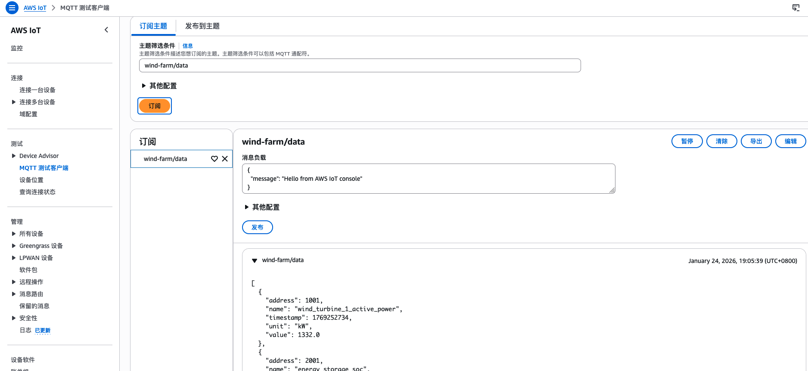

# Lab 5 Workshop 向导: AWS IoT Core 集成

## 🎯 实验目标

通过本实验,你将学习:
- 订阅 Greengrass IPC topic 接收数据
- 使用 PublishToIoTCore 发布到 AWS IoT Core
- 实现异步消息处理避免阻塞
- 配置多个 AccessControl 权限
- 完成完整的边缘到云数据管道
- 在 IoT Core 控制台查看实时数据

**预计时间**: 90 分钟  
**难度级别**: ⭐⭐⭐ 高级

## 📋 前置条件

### 必需环境
- ✅ 完成 Lab 1, Lab 2, Lab 3, Lab 4
- ✅ Lab 3 的 IEC104 Simulator 已部署并运行
- ✅ Lab 4 的 IEC104 Collector 已部署并运行
- ✅ 理解异步编程和多线程
- ✅ 了解 MQTT 协议基础

### 验证环境

```bash
# 检查前置组件运行状态
sudo /greengrass/v2/bin/greengrass-cli component list | grep -E "IEC104|Simulator"

# 测试 IPC topic 是否有数据
sudo /greengrass/v2/bin/greengrass-cli pubsub subscribe --topic iec104/data

# 检查 IoT Core 连接
aws iot describe-endpoint --endpoint-type iot:Data-ATS --region ${AWS_REGION}
```

## 🏗️ 架构概览

### 整体架构

```
┌─────────────────────────────────────────────────────────────────┐
│  Greengrass Core Device                                         │
│                                                                 │
│  ┌──────────────────────────────────────────────────────────┐  │
│  │  IEC104 Simulator (Lab 3)                                │  │
│  │  - Docker Container                                      │  │
│  │  - 模拟 6 个数据点                                        │  │
│  └────────────────────┬─────────────────────────────────────┘  │
│                       │ IEC104 Protocol                         │
│                       ↓                                         │
│  ┌──────────────────────────────────────────────────────────┐  │
│  │  IEC104 Collector (Lab 4)                                │  │
│  │  - 采集数据                                               │  │
│  │  - 过滤 IOA 1001, 2001                                   │  │
│  │  - 转换为 JSON                                            │  │
│  │  - PublishToTopic → iec104/data                          │  │
│  └────────────────────┬─────────────────────────────────────┘  │
│                       │                                         │
│                       │ Greengrass IPC Pubsub                  │
│                       │ Topic: iec104/data                     │
│                       │                                         │
│                       ↓                                         │
│  ┌──────────────────────────────────────────────────────────┐  │
│  │  IoT Publisher (Lab 5)                                   │  │
│  │                                                           │  │
│  │  ┌─────────────────────────────────────────────────┐    │  │
│  │  │  IPC Subscriber                                  │    │  │
│  │  │  - SubscribeToTopic (iec104/data)               │    │  │
│  │  │  - StreamHandler 回调                            │    │  │
│  │  └──────────────────┬──────────────────────────────┘    │  │
│  │                     │                                     │  │
│  │  ┌──────────────────▼──────────────────────────────┐    │  │
│  │  │  消息队列 (线程安全)                             │    │  │
│  │  │  - std::queue<std::string>                      │    │  │
│  │  │  - std::mutex 保护                               │    │  │
│  │  └──────────────────┬──────────────────────────────┘    │  │
│  │                     │                                     │  │
│  │  ┌──────────────────▼──────────────────────────────┐    │  │
│  │  │  主线程处理循环                                  │    │  │
│  │  │  - 从队列取消息                                  │    │  │
│  │  │  - PublishToIoTCore                              │    │  │
│  │  │  - 错误处理和重试                                │    │  │
│  │  └──────────────────────────────────────────────────┘    │  │
│  └──────────────────────────────────────────────────────────┘  │
│                       │                                         │
│                       │ MQTT over TLS                           │
│                       │ Topic: wind-farm/data                  │
│                       │ QoS: AT_LEAST_ONCE                     │
└───────────────────────┼─────────────────────────────────────────┘
                        │
                        ↓
┌─────────────────────────────────────────────────────────────────┐
│  AWS IoT Core                                                   │
│                                                                 │
│  ┌────────────────────────────────────────────────────────┐    │
│  │  MQTT Broker                                           │    │
│  │  - Topic: wind-farm/data                               │    │
│  │  - 接收来自 Greengrass 的消息                          │    │
│  └────────────────────┬───────────────────────────────────┘    │
│                       │                                         │
│                       ↓                                         │
│  ┌────────────────────────────────────────────────────────┐    │
│  │  IoT Core 规则引擎 (可选)                              │    │
│  │  - 路由到其他 AWS 服务                                 │    │
│  │  - DynamoDB, S3, Lambda, etc.                          │    │
│  └────────────────────────────────────────────────────────┘    │
└─────────────────────────────────────────────────────────────────┘
```

### 核心概念

#### 1. 异步消息处理模式

**问题**: 在 StreamHandler 回调中直接调用 PublishToIoTCore 会阻塞事件循环

```
❌ 错误模式:
OnStreamEvent 回调
  ↓
直接调用 PublishToIoTCore (阻塞)
  ↓
等待响应 (阻塞事件循环)
  ↓
其他消息无法处理
```

**解决方案**: 使用消息队列解耦

```
✅ 正确模式:
OnStreamEvent 回调
  ↓
放入消息队列 (非阻塞)
  ↓
立即返回
  ↓
主线程从队列取消息
  ↓
调用 PublishToIoTCore
  ↓
不阻塞事件循环
```

#### 2. IPC SubscribeToTopic

**订阅流程**:
```
1. 创建 SubscribeToTopicRequest
   ├── 设置 topic
   └── 创建 StreamHandler
2. 创建订阅操作
   NewSubscribeToTopic()
3. 激活订阅
   Activate(request, handler)
4. 接收消息
   OnStreamEvent() 回调
```

**StreamHandler 实现**:
```cpp
class MessageHandler : public SubscribeToTopicStreamHandler {
public:
    void OnStreamEvent(SubscriptionResponseMessage *response) override {
        // 获取消息内容
        auto messageBytes = response->GetBinaryMessage()
            .value().GetMessage().value();
        std::string payload(messageBytes.begin(), messageBytes.end());
        
        // 放入队列 (不阻塞)
        std::lock_guard<std::mutex> lock(g_queueMutex);
        g_messageQueue.push(payload);
    }
    
    bool OnStreamError(RpcError error) override {
        std::cerr << "Stream error: " << error.GetMessage() << std::endl;
        return false;  // 停止订阅
    }
    
    void OnStreamClosed() override {
        std::cout << "Stream closed" << std::endl;
    }
};
```

#### 3. PublishToIoTCore

**发布流程**:
```
1. 创建 PublishToIoTCoreRequest
   ├── 设置 topic
   ├── 设置 payload
   └── 设置 QoS
2. 创建发布操作
   NewPublishToIoTCore()
3. 激活操作
   Activate(request, nullptr)
4. 获取结果
   GetResult()
```

**QoS 级别**:
| QoS | 说明 | 使用场景 |
|-----|------|----------|
| **AT_MOST_ONCE** (0) | 最多一次,可能丢失 | 不重要的数据 |
| **AT_LEAST_ONCE** (1) | 至少一次,可能重复 | 重要数据 (推荐) |

#### 4. AccessControl 双权限配置

**需要两个权限**:

**权限 1**: IPC Pubsub (订阅)
```yaml
aws.greengrass.ipc.pubsub:
  "com.example.IoTPublisher:pubsub:1":
    operations:
      - "aws.greengrass#SubscribeToTopic"
    resources:
      - "iec104/data"
```

**权限 2**: MQTT Proxy (发布到 IoT Core)
```yaml
aws.greengrass.ipc.mqttproxy:
  "com.example.IoTPublisher:mqttproxy:1":
    operations:
      - "aws.greengrass#PublishToIoTCore"
    resources:
      - "wind-farm/data"
```

## 📁 项目结构

```
lab5-iot-integration/
├── src/
│   └── iot_publisher.cpp       # IoT Publisher 源代码
├── aws-iot-device-sdk-cpp-v2/  # AWS IoT SDK (submodule)
├── CMakeLists.txt              # CMake 构建配置
├── recipe.yaml                 # Greengrass 组件配置
├── config.json                 # 示例配置文件
├── build.sh                    # 构建脚本
├── package.sh                  # 打包脚本
└── deploy.sh                   # 部署脚本
```

## 实验分为三个部分

### Part 1: 本地开发和测试 (步骤 1-4)
- 理解异步消息处理
- 理解 SubscribeToTopic 和 PublishToIoTCore
- 本地构建和测试

### Part 2: 打包和部署 (步骤 5-7)
- 打包组件
- 配置双 AccessControl 权限
- 部署完整数据管道

### Part 3: 验证和监控 (步骤 8-9)
- 验证数据流
- 在 IoT Core 查看消息
- 性能监控和优化


---

# Part 1: 本地开发和测试

## 🔧 实验步骤

### 步骤 1: 准备实验环境

#### 1.1 进入实验目录

```bash
cd /home/ubuntu/iec104-greengrass/workshop/lab5-iot-integration
```

#### 1.2 下载并编译 AWS IoT SDK (如果还没有)

**如果在 Lab4 中已经编译安装过 SDK,可以跳过此步骤。**

**步骤 1: 下载 SDK**

```bash
# 初始化 submodule
git submodule update --init --recursive

# 验证 SDK 已下载
ls -la aws-iot-device-sdk-cpp-v2/
```

**步骤 2: 编译并安装 SDK (如果还没有)**

```bash
cd aws-iot-device-sdk-cpp-v2

# 创建构建目录
mkdir -p build
cd build

# 配置 CMake
cmake .. \
  -DCMAKE_BUILD_TYPE=Release \
  -DBUILD_DEPS=ON \
  -DCMAKE_INSTALL_PREFIX=/usr/local

# 编译 (使用所有 CPU 核心)
make -j$(nproc)

# 安装到系统目录
sudo make install

# 更新动态链接库缓存
sudo ldconfig

cd ../..
```

**步骤 3: 验证安装**

```bash
# 检查库文件
ls /usr/local/lib/libGreengrassIpc-cpp.* 2>/dev/null || \
ls /usr/local/lib64/libGreengrassIpc-cpp.* 2>/dev/null
```

**注意**: 如果在 Lab4 中已经安装,这里会显示已存在的库文件。

#### 1.3 设置环境变量

```bash
# 设置 AWS 区域
export AWS_REGION="ap-northeast-1"

# 使用之前创建的 S3 存储桶
export COMPONENT_BUCKET="iec104-greengrass-components-<your-timestamp>"

# 设置 Greengrass Thing 名称
export THING_NAME="GreengrassQuickStartCore-19be3781cbc"

# 获取账户 ID
export ACCOUNT_ID=$(aws sts get-caller-identity --query Account --output text)

# 设置组件版本
export VERSION="1.0.1"
export COMPONENT_NAME="com.example.IoTPublisher"
```

#### 1.4 验证前置组件运行

```bash
# 检查 IEC104 Simulator
docker ps | grep iec104-simulator

# 检查 IEC104 Collector
sudo /greengrass/v2/bin/greengrass-cli component list | grep IEC104Collector

# 测试 IPC topic 是否有数据
sudo /greengrass/v2/bin/greengrass-cli pubsub subscribe --topic iec104/data
```

**预期输出** (IPC 订阅):
```
Subscribed to topic: iec104/data
Received message:
[{"address":1001,"name":"wind_turbine_1_active_power","value":1500.0,"unit":"kW","timestamp":1737622800},{"address":2001,"name":"energy_storage_soc","value":75.0,"unit":"%","timestamp":1737622800}]
```

---

### 步骤 2: 理解异步消息处理

#### 2.1 为什么需要异步处理?

**问题场景**:
```cpp
// ❌ 错误: 在回调中直接发布
void OnStreamEvent(SubscriptionResponseMessage *response) override {
    auto payload = getPayload(response);
    
    // 这里会阻塞事件循环!
    publishToIoTCore(payload);  // 可能需要几百毫秒
    
    // 在等待响应期间,其他消息无法处理
}
```

**问题**:
- `publishToIoTCore` 是同步操作,需要等待响应
- 阻塞 `OnStreamEvent` 回调
- 事件循环被阻塞,无法处理其他消息
- 可能导致消息积压和超时

#### 2.2 消息队列解决方案

**架构**:
```
┌─────────────────────────────────────────────────────────┐
│  IPC 事件循环线程                                        │
│                                                         │
│  OnStreamEvent() 回调                                   │
│    ↓                                                    │
│  获取消息                                                │
│    ↓                                                    │
│  放入队列 (加锁)  ←─────────────────┐                   │
│    ↓                                │                   │
│  立即返回 (不阻塞)                   │                   │
└─────────────────────────────────────┼───────────────────┘
                                      │
                    std::queue + std::mutex
                                      │
┌─────────────────────────────────────┼───────────────────┐
│  主线程                              │                   │
│                                     │                   │
│  while (running) {                  │                   │
│    从队列取消息 (加锁) ──────────────┘                   │
│      ↓                                                  │
│    调用 publishToIoTCore()                              │
│      ↓                                                  │
│    等待响应 (不影响事件循环)                             │
│      ↓                                                  │
│    sleep(100ms)                                         │
│  }                                                      │
└─────────────────────────────────────────────────────────┘
```

#### 2.3 实现代码

**全局变量**:
```cpp
// 消息队列
std::queue<std::string> g_messageQueue;
std::mutex g_queueMutex;

// 运行标志
std::atomic<bool> g_running{true};
```

**StreamHandler 实现**:
```cpp
class MessageHandler : public SubscribeToTopicStreamHandler {
public:
    void OnStreamEvent(SubscriptionResponseMessage *response) override {
        // 1. 获取消息
        auto binaryMessage = response->GetBinaryMessage();
        if (!binaryMessage.has_value()) {
            return;
        }
        
        auto messageBytes = binaryMessage.value().GetMessage();
        if (!messageBytes.has_value()) {
            return;
        }
        
        std::string payload(messageBytes.value().begin(), 
                           messageBytes.value().end());
        
        // 2. 放入队列 (线程安全)
        {
            std::lock_guard<std::mutex> lock(g_queueMutex);
            g_messageQueue.push(payload);
        }
        
        // 3. 立即返回,不阻塞
        std::cout << "[DEBUG] Message queued, size: " 
                  << g_messageQueue.size() << std::endl;
    }
    
    bool OnStreamError(RpcError error) override {
        std::cerr << "[ERROR] Stream error: " 
                  << error.GetMessage() << std::endl;
        return false;  // 停止订阅
    }
    
    void OnStreamClosed() override {
        std::cout << "[INFO] Stream closed" << std::endl;
    }
};
```

**主线程处理循环**:
```cpp
int main() {
    // ... 初始化 IPC 客户端和订阅 ...
    
    // 主循环
    while (g_running) {
        std::string payload;
        
        // 1. 从队列取消息
        {
            std::lock_guard<std::mutex> lock(g_queueMutex);
            if (!g_messageQueue.empty()) {
                payload = g_messageQueue.front();
                g_messageQueue.pop();
            }
        }
        
        // 2. 如果有消息,发布到 IoT Core
        if (!payload.empty()) {
            if (publishToIoTCore(ipcClient, payload)) {
                std::cout << "[INFO] Published to IoT Core" << std::endl;
            } else {
                std::cerr << "[ERROR] Failed to publish" << std::endl;
            }
        }
        
        // 3. 短暂休眠,避免 CPU 占用过高
        std::this_thread::sleep_for(std::chrono::milliseconds(100));
    }
    
    return 0;
}
```

---

### 步骤 3: 理解 IPC 操作

#### 3.1 SubscribeToTopic 实现

**完整流程**:

```cpp
bool subscribeToTopic(GreengrassCoreIpcClient& ipcClient, 
                      const std::string& topic) {
    // 1. 创建请求
    SubscribeToTopicRequest request;
    request.SetTopic(topic);
    
    // 2. 创建 StreamHandler
    auto streamHandler = std::make_shared<MessageHandler>();
    
    // 3. 创建订阅操作
    auto operation = ipcClient.NewSubscribeToTopic(streamHandler);
    
    // 4. 激活订阅
    auto activate = operation->Activate(request, nullptr).get();
    if (!activate) {
        std::cerr << "Failed to activate subscription" << std::endl;
        return false;
    }
    
    std::cout << "Subscribed to topic: " << topic << std::endl;
    return true;
}
```

#### 3.2 PublishToIoTCore 实现

**完整流程**:

```cpp
bool publishToIoTCore(GreengrassCoreIpcClient& ipcClient,
                      const std::string& topic,
                      const std::string& payload) {
    // 1. 创建请求
    PublishToIoTCoreRequest request;
    request.SetTopicName(topic);
    
    // 2. 设置 QoS
    request.SetQos(QOS_AT_LEAST_ONCE);
    
    // 3. 设置 payload
    Vector<uint8_t> payloadBytes(payload.begin(), payload.end());
    request.SetPayload(payloadBytes);
    
    // 4. 创建操作
    auto operation = ipcClient.NewPublishToIoTCore();
    
    // 5. 激活操作
    auto activate = operation->Activate(request, nullptr).get();
    if (!activate) {
        std::cerr << "Failed to activate publish" << std::endl;
        return false;
    }
    
    // 6. 获取结果 (带超时)
    auto responseFuture = operation->GetResult();
    if (responseFuture.wait_for(std::chrono::seconds(5)) == 
        std::future_status::timeout) {
        std::cerr << "Publish timeout" << std::endl;
        return false;
    }
    
    auto response = responseFuture.get();
    if (response) {
        return true;
    } else {
        std::cerr << "Publish failed: " 
                  << response.GetResultError().GetMessage() << std::endl;
        return false;
    }
}
```

#### 3.3 关键注意事项 ⚠️

**1. StreamHandler 生命周期**:
```cpp
// ❌ 错误: 局部变量,会被销毁
auto streamHandler = MessageHandler();
auto operation = ipcClient.NewSubscribeToTopic(&streamHandler);

// ✅ 正确: 使用 shared_ptr
auto streamHandler = std::make_shared<MessageHandler>();
auto operation = ipcClient.NewSubscribeToTopic(streamHandler);
```

**2. 订阅操作保持活跃**:
```cpp
// ❌ 错误: operation 离开作用域后订阅失效
{
    auto operation = ipcClient.NewSubscribeToTopic(streamHandler);
    operation->Activate(request, nullptr).get();
}  // operation 被销毁,订阅失效

// ✅ 正确: 保持 operation 存活
auto operation = ipcClient.NewSubscribeToTopic(streamHandler);
operation->Activate(request, nullptr).get();
// operation 在整个程序运行期间保持存活
```

**3. QoS 选择**:
```cpp
// 重要数据使用 QoS 1
request.SetQos(QOS_AT_LEAST_ONCE);

// 不重要数据可以使用 QoS 0
request.SetQos(QOS_AT_MOST_ONCE);
```

---

### 步骤 4: 本地构建和测试

#### 4.1 构建组件

```bash
# 使用构建脚本
./build.sh
```

**预期输出**:
```
-- The C compiler identification is GNU 11.4.0
-- The CXX compiler identification is GNU 11.4.0
-- Configuring done
-- Generating done
-- Build files have been written to: .../build
[ 50%] Building CXX object CMakeFiles/iot_publisher.dir/src/iot_publisher.cpp.o
[100%] Linking CXX executable iot_publisher
[100%] Built target iot_publisher
```

#### 4.2 验证构建结果

```bash
# 查看生成的二进制文件
ls -lh build/iot_publisher

# 检查文件类型
file build/iot_publisher
```

#### 4.3 本地测试 (模拟 IPC 消息)

**准备测试配置**:

```bash
# 创建测试配置文件
cat > /tmp/publisher-config.json << 'EOF'
{
  "ipcTopic": "iec104/data",
  "iotTopic": "wind-farm/data",
  "qos": "AT_LEAST_ONCE"
}
EOF
```

**注意**: 本地测试需要 Greengrass 环境,因为需要连接到 IPC。

```bash
# 在 Greengrass 环境中测试
sudo -E ./build/iot_publisher /tmp/publisher-config.json
```

**预期输出**:
```
[INFO] IoT Publisher starting...
[INFO] Configuration loaded
[INFO] Connected to Greengrass IPC
[INFO] Subscribed to IPC topic: iec104/data
[INFO] Waiting for messages...
[DEBUG] Message queued, size: 1
[INFO] Published to IoT Core topic: wind-farm/data
```

---

# Part 2: 打包和部署

### 步骤 5: 打包组件

#### 5.1 执行打包

```bash
# 使用打包脚本
./package.sh
```

#### 5.2 验证打包结果

```bash
# 查看 ZIP 包内容
unzip -l artifacts/com.example.IoTPublisher-${VERSION}.zip
```

**预期输出**:
```
Archive:  artifacts/com.example.IoTPublisher-1.0.1.zip
  Length      Date    Time    Name
---------  ---------- -----   ----
        0  2026-01-23 11:00   iot_publisher/
  2602932  2026-01-23 11:00   iot_publisher/iot_publisher
---------                     -------
  2602932                     2 files
```

#### 5.3 上传到 S3

```bash
# 上传 ZIP 包
aws s3 cp artifacts/com.example.IoTPublisher-${VERSION}.zip \
  s3://${COMPONENT_BUCKET}/com.example.IoTPublisher/${VERSION}/ \
  --region ${AWS_REGION}

# 验证上传成功
aws s3 ls s3://${COMPONENT_BUCKET}/com.example.IoTPublisher/${VERSION}/ \
  --region ${AWS_REGION}
```

#### 5.4 更新 Recipe 中的 S3 路径

```bash
# 使用 sed 替换 S3 路径
sed "s|s3://your-bucket|s3://${COMPONENT_BUCKET}|g" \
  artifacts/recipe.json > artifacts/recipe-updated.json

# 验证替换结果
grep "URI" artifacts/recipe-updated.json
```

---

### 步骤 6: 配置双 AccessControl 权限 ⚠️ 关键

#### 6.1 理解双权限配置

**需要两个独立的权限**:

**权限 1**: IPC Pubsub (订阅 IPC topic)
```yaml
aws.greengrass.ipc.pubsub:
  "com.example.IoTPublisher:pubsub:1":
    policyDescription: "Allow subscribing to iec104/data topic"
    operations:
      - "aws.greengrass#SubscribeToTopic"
    resources:
      - "iec104/data"
```

**权限 2**: MQTT Proxy (发布到 IoT Core)
```yaml
aws.greengrass.ipc.mqttproxy:
  "com.example.IoTPublisher:mqttproxy:1":
    policyDescription: "Allow publishing to IoT Core"
    operations:
      - "aws.greengrass#PublishToIoTCore"
    resources:
      - "wind-farm/data"
```

#### 6.2 完整 AccessControl 配置

**Recipe 中的配置**:
```yaml
ComponentConfiguration:
  DefaultConfiguration:
    ipcTopic: "iec104/data"
    iotTopic: "wind-farm/data"
    qos: "AT_LEAST_ONCE"
    accessControl:
      aws.greengrass.ipc.pubsub:
        "com.example.IoTPublisher:pubsub:1":
          policyDescription: "Allow subscribing to iec104/data topic"
          operations:
            - "aws.greengrass#SubscribeToTopic"
          resources:
            - "iec104/data"
      aws.greengrass.ipc.mqttproxy:
        "com.example.IoTPublisher:mqttproxy:1":
          policyDescription: "Allow publishing to IoT Core"
          operations:
            - "aws.greengrass#PublishToIoTCore"
          resources:
            - "wind-farm/data"
```

**部署时的 JSON 配置**:
```json
{
  "ipcTopic": "iec104/data",
  "iotTopic": "wind-farm/data",
  "qos": "AT_LEAST_ONCE",
  "accessControl": {
    "aws.greengrass.ipc.pubsub": {
      "com.example.IoTPublisher:pubsub:1": {
        "policyDescription": "Allow subscribing to iec104/data topic",
        "operations": ["aws.greengrass#SubscribeToTopic"],
        "resources": ["iec104/data"]
      }
    },
    "aws.greengrass.ipc.mqttproxy": {
      "com.example.IoTPublisher:mqttproxy:1": {
        "policyDescription": "Allow publishing to IoT Core",
        "operations": ["aws.greengrass#PublishToIoTCore"],
        "resources": ["wind-farm/data"]
      }
    }
  }
}
```

#### 6.3 常见权限错误

**错误 1**: 只配置了一个权限
```
[ERROR] UNAUTHORIZED: SubscribeToTopic
或
[ERROR] UNAUTHORIZED: PublishToIoTCore
```

**解决**: 确保两个权限都配置

**错误 2**: 资源不匹配
```
[ERROR] Access denied for topic: wind-farm/data
```

**解决**: 确保 resources 包含实际使用的 topic

**错误 3**: 操作类型错误
```
[ERROR] Operation not allowed
```

**解决**: 确保 operations 包含正确的操作名称


---

### 步骤 7: 注册和部署完整数据管道

#### 7.1 注册组件版本

**使用 AWS CLI**:

```bash
# 创建组件版本
aws greengrassv2 create-component-version \
  --inline-recipe fileb://artifacts/recipe-updated.json \
  --region ${AWS_REGION}
```

**预期输出**:
```json
{
    "arn": "arn:aws:greengrass:ap-northeast-1:123456789012:components:com.example.IoTPublisher:versions:1.0.1",
    "componentName": "com.example.IoTPublisher",
    "componentVersion": "1.0.1",
    "creationTimestamp": "2026-01-23T12:00:00.000000+00:00",
    "status": {
        "componentState": "REQUESTED"
    }
}
```

#### 7.2 部署完整数据管道 (三个组件)

**使用 AWS CLI**:

```bash
# 创建部署 (Simulator + Collector + Publisher)
aws greengrassv2 create-deployment \
  --target-arn "arn:aws:iot:${AWS_REGION}:${ACCOUNT_ID}:thing/${THING_NAME}" \
  --deployment-name "IEC104-Complete-Pipeline-$(date +%s)" \
  --components '{
    "com.example.IEC104SimulatorDocker": {
      "componentVersion": "1.0.0",
      "configurationUpdate": {
        "merge": "{\"ImageUri\":\"'${ACCOUNT_ID}'.dkr.ecr.'${AWS_REGION}'.amazonaws.com/iec104-simulator:1.0.0\",\"ContainerName\":\"iec104-simulator\",\"HostPort\":\"2404\"}"
      }
    },
    "com.example.IEC104Collector": {
      "componentVersion": "1.0.1",
      "configurationUpdate": {
        "merge": "{\"serverHost\":\"localhost\",\"serverPort\":2404,\"ipcTopic\":\"iec104/data\",\"accessControl\":{\"aws.greengrass.ipc.pubsub\":{\"com.example.IEC104Collector:pubsub:1\":{\"policyDescription\":\"Allow publishing to iec104/data topic\",\"operations\":[\"aws.greengrass#PublishToTopic\"],\"resources\":[\"iec104/data\"]}}}}"
      }
    },
    "com.example.IoTPublisher": {
      "componentVersion": "'"${VERSION}"'",
      "configurationUpdate": {
        "merge": "{\"ipcTopic\":\"iec104/data\",\"iotTopic\":\"wind-farm/data\",\"qos\":\"AT_LEAST_ONCE\",\"accessControl\":{\"aws.greengrass.ipc.pubsub\":{\"com.example.IoTPublisher:pubsub:1\":{\"policyDescription\":\"Allow subscribing to iec104/data topic\",\"operations\":[\"aws.greengrass#SubscribeToTopic\"],\"resources\":[\"iec104/data\"]}},\"aws.greengrass.ipc.mqttproxy\":{\"com.example.IoTPublisher:mqttproxy:1\":{\"policyDescription\":\"Allow publishing to IoT Core\",\"operations\":[\"aws.greengrass#PublishToIoTCore\"],\"resources\":[\"wind-farm/data\"]}}}}"
      }
    }
  }' \
  --region ${AWS_REGION}
```

**配置说明**:
- **Simulator**: 模拟 IEC104 数据源
- **Collector**: 采集数据并发布到 IPC topic
- **Publisher**: 订阅 IPC topic 并转发到 IoT Core

**预期输出**:
```json
{
    "deploymentId": "a1b2c3d4-5678-90ab-cdef-EXAMPLE11111",
    "iotJobId": "a1b2c3d4-5678-90ab-cdef-EXAMPLE22222"
}
```

```bash
# 保存部署 ID
export DEPLOYMENT_ID="<your-deployment-id>"
```

**使用 AWS 管理控制台**:

1. 在 **Core devices** 页面,点击你的设备
2. 点击 **Deploy** 按钮
3. 选择 **Revise deployment**
4. 确保包含三个组件:
   - `com.example.IEC104SimulatorDocker` (版本 1.0.0)
   - `com.example.IEC104Collector` (版本 1.0.1)
   - `com.example.IoTPublisher` (版本 1.0.1)
5. 配置 IoTPublisher:
```json
{
  "ipcTopic": "iec104/data",
  "iotTopic": "wind-farm/data",
  "qos": "AT_LEAST_ONCE",
  "accessControl": {
    "aws.greengrass.ipc.pubsub": {
      "com.example.IoTPublisher:pubsub:1": {
        "policyDescription": "Allow subscribing to iec104/data topic",
        "operations": ["aws.greengrass#SubscribeToTopic"],
        "resources": ["iec104/data"]
      }
    },
    "aws.greengrass.ipc.mqttproxy": {
      "com.example.IoTPublisher:mqttproxy:1": {
        "policyDescription": "Allow publishing to IoT Core",
        "operations": ["aws.greengrass#PublishToIoTCore"],
        "resources": ["wind-farm/data"]
      }
    }
  }
}
```
6. 点击 **Deploy**


*截图位置: 部署完整数据管道配置*

#### 7.3 监控部署状态

```bash
# 查看部署状态
aws greengrassv2 get-deployment \
  --deployment-id ${DEPLOYMENT_ID} \
  --region ${AWS_REGION} \
  --query 'deploymentStatus' \
  --output text

# 持续监控
watch -n 5 "aws greengrassv2 get-deployment \
  --deployment-id ${DEPLOYMENT_ID} \
  --region ${AWS_REGION} \
  --query 'deploymentStatus' \
  --output text"
```

---

# Part 3: 验证和监控

### 步骤 8: 验证数据流

#### 8.1 查看组件状态

```bash
# 查看所有组件
sudo /greengrass/v2/bin/greengrass-cli component list
```

**预期输出**:
```
Component Name: com.example.IEC104SimulatorDocker
    Version: 1.0.0
    State: RUNNING
Component Name: com.example.IEC104Collector
    Version: 1.0.1
    State: RUNNING
Component Name: com.example.IoTPublisher
    Version: 1.0.1
    State: RUNNING
    Configuration: {"ipcTopic":"iec104/data","iotTopic":"wind-farm/data",...}
```

#### 8.2 查看 IoTPublisher 日志

```bash
# 实时查看日志
sudo tail -f /greengrass/v2/logs/com.example.IoTPublisher.log
```

**预期日志**:
```
2026-01-23T12:05:00.000Z [INFO] (Copier) com.example.IoTPublisher: stdout. [INFO] IoT Publisher starting...
2026-01-23T12:05:00.100Z [INFO] (Copier) com.example.IoTPublisher: stdout. [INFO] Configuration loaded
2026-01-23T12:05:00.200Z [INFO] (Copier) com.example.IoTPublisher: stdout. [INFO] Connected to Greengrass IPC
2026-01-23T12:05:00.300Z [INFO] (Copier) com.example.IoTPublisher: stdout. [INFO] Subscribed to IPC topic: iec104/data
2026-01-23T12:05:00.400Z [INFO] (Copier) com.example.IoTPublisher: stdout. [DEBUG] Message queued, size: 1
2026-01-23T12:05:00.500Z [INFO] (Copier) com.example.IoTPublisher: stdout. [INFO] Published to IoT Core topic: wind-farm/data
2026-01-23T12:05:05.500Z [INFO] (Copier) com.example.IoTPublisher: stdout. [DEBUG] Message queued, size: 1
2026-01-23T12:05:05.600Z [INFO] (Copier) com.example.IoTPublisher: stdout. [INFO] Published to IoT Core topic: wind-farm/data
```

#### 8.3 验证完整数据流

**数据流验证**:

```
1. Simulator 生成数据
   ↓
2. Collector 采集数据
   ↓
3. Collector 发布到 IPC
   ↓
4. Publisher 订阅 IPC
   ↓
5. Publisher 发布到 IoT Core
```

**验证步骤**:

```bash
# 1. 检查 Simulator
docker logs iec104-simulator | tail -10

# 2. 检查 Collector
sudo grep "Published.*IPC" /greengrass/v2/logs/com.example.IEC104Collector.log | tail -5

# 3. 检查 Publisher
sudo grep "Published.*IoT Core" /greengrass/v2/logs/com.example.IoTPublisher.log | tail -5
```

---

### 步骤 9: 在 IoT Core 查看消息

#### 9.1 使用 AWS CLI 订阅 MQTT Topic

```bash
# 订阅 IoT Core topic
aws iot-data subscribe \
  --topic wind-farm/data \
  --region ${AWS_REGION}
```

**注意**: AWS CLI 的 `iot-data subscribe` 命令在某些区域可能不可用。

#### 9.2 使用 AWS IoT Core 控制台 (推荐)

**步骤**:

1. 打开 [AWS IoT Core 控制台](https://console.amazonaws.cn/iot/)
2. 左侧菜单: **Test** → **MQTT test client**
3. 在 **Subscribe to a topic** 部分
4. 输入 Topic: `wind-farm/data`
5. 点击 **Subscribe**


*截图位置: IoT Core MQTT 测试客户端*

**预期看到的消息**:
```json
[
  {
    "address": 1001,
    "name": "wind_turbine_1_active_power",
    "value": 1500.0,
    "unit": "kW",
    "timestamp": 1737622800
  },
  {
    "address": 2001,
    "name": "energy_storage_soc",
    "value": 75.0,
    "unit": "%",
    "timestamp": 1737622800
  }
]
```


*截图位置: IoT Core 接收到的消息*

#### 9.3 使用 mosquitto_sub 订阅 (本地测试)

```bash
# 安装 mosquitto 客户端
sudo apt-get install mosquitto-clients

# 获取 IoT Core 端点
export IOT_ENDPOINT=$(aws iot describe-endpoint \
  --endpoint-type iot:Data-ATS \
  --region ${AWS_REGION} \
  --query 'endpointAddress' \
  --output text)

# 订阅 topic (需要证书)
mosquitto_sub \
  --host ${IOT_ENDPOINT} \
  --port 8883 \
  --topic wind-farm/data \
  --cafile /greengrass/v2/rootCA.pem \
  --cert /greengrass/v2/thingCert.crt \
  --key /greengrass/v2/privKey.key
```

#### 9.4 验证消息频率

```bash
# 统计每分钟的消息数量
sudo grep "Published to IoT Core" /greengrass/v2/logs/com.example.IoTPublisher.log | \
  tail -100 | \
  awk '{print $1}' | \
  uniq -c
```

**预期输出** (假设每 5 秒一条消息):
```
12 2026-01-23T12:05:00.000Z
12 2026-01-23T12:06:00.000Z
12 2026-01-23T12:07:00.000Z
```

#### 9.5 性能监控

**查看消息队列大小**:
```bash
# 查看日志中的队列大小
sudo grep "Message queued" /greengrass/v2/logs/com.example.IoTPublisher.log | tail -20
```

**预期**: 队列大小应该保持在较小值 (< 10)

**如果队列持续增长**:
- 可能是发布速度慢于接收速度
- 需要优化发布逻辑或增加处理线程

**查看组件资源使用**:
```bash
# 查看进程资源
ps aux | grep iot_publisher

# 查看内存使用
sudo /greengrass/v2/bin/greengrass-cli component details \
  --name com.example.IoTPublisher
```

---

## 📚 核心概念总结

### 1. 异步消息处理模式

```
同步模式 (❌ 错误):
OnStreamEvent → PublishToIoTCore (阻塞) → 等待响应 → 返回
问题: 阻塞事件循环,无法处理其他消息

异步模式 (✅ 正确):
OnStreamEvent → 放入队列 (非阻塞) → 立即返回
主线程 → 从队列取消息 → PublishToIoTCore → 等待响应
优势: 不阻塞事件循环,可以处理多个消息
```

### 2. IPC 操作对比

| 操作 | 用途 | 关键点 |
|------|------|--------|
| **PublishToTopic** | 发布到 IPC topic | 本地通信,低延迟 |
| **SubscribeToTopic** | 订阅 IPC topic | 需要 StreamHandler |
| **PublishToIoTCore** | 发布到 IoT Core | 需要网络,有延迟 |

### 3. AccessControl 权限总结

| 服务类型 | 操作 | 资源 | 用途 |
|---------|------|------|------|
| `aws.greengrass.ipc.pubsub` | `SubscribeToTopic` | IPC topic 名称 | 订阅本地消息 |
| `aws.greengrass.ipc.pubsub` | `PublishToTopic` | IPC topic 名称 | 发布本地消息 |
| `aws.greengrass.ipc.mqttproxy` | `PublishToIoTCore` | IoT topic 名称 | 发布到云端 |

### 4. 完整数据管道

```
IEC104 Simulator (Docker)
  ↓ IEC104 Protocol
IEC104 Collector
  ├── 采集数据
  ├── 过滤 (IOA 1001, 2001)
  ├── 转换为 JSON
  └── PublishToTopic (iec104/data)
       ↓ Greengrass IPC Pubsub
IoT Publisher
  ├── SubscribeToTopic (iec104/data)
  ├── 消息队列缓冲
  └── PublishToIoTCore (wind-farm/data)
       ↓ MQTT over TLS
AWS IoT Core
  └── MQTT Broker
```

## 🎓 实验总结

通过本实验,你已经学会:

### ✅ 核心技能
- 订阅 Greengrass IPC topic 接收数据
- 使用 PublishToIoTCore 发布到 AWS IoT Core
- 实现异步消息处理避免阻塞
- 配置多个 AccessControl 权限
- 完成完整的边缘到云数据管道
- 在 IoT Core 控制台查看实时数据
- 性能监控和优化

### ✅ 关键概念
- 异步消息处理模式
- StreamHandler 生命周期管理
- IPC Pubsub 和 MQTT Proxy
- 双 AccessControl 权限配置
- 消息队列和线程安全

### ✅ 最佳实践
- 使用消息队列解耦回调和发布
- 在主线程处理 IoT Core 发布
- 使用 shared_ptr 管理 StreamHandler
- 保持订阅操作存活
- 添加超时处理
- 使用 QoS 1 确保消息可靠性
- 监控队列大小避免积压

## 🔍 常见问题

### Q1: 为什么不能在 OnStreamEvent 回调中直接发布到 IoT Core?

**原因**: `PublishToIoTCore` 是同步操作,会阻塞事件循环。在回调中阻塞会导致:
- 其他消息无法处理
- 可能导致超时
- 降低系统吞吐量

**解决**: 使用消息队列,在主线程中处理发布。

### Q2: StreamHandler 为什么要使用 shared_ptr?

**原因**: StreamHandler 需要在整个订阅期间保持存活。如果使用局部变量或裸指针,可能会被提前销毁。

**正确用法**:
```cpp
auto streamHandler = std::make_shared<MessageHandler>();
auto operation = ipcClient.NewSubscribeToTopic(streamHandler);
```

### Q3: 如何确保消息不丢失?

**方法**:
1. 使用 QoS 1 (AT_LEAST_ONCE)
2. 添加重试机制
3. 监控队列大小
4. 记录失败的消息

### Q4: 消息队列持续增长怎么办?

**原因**: 发布速度慢于接收速度

**解决方案**:
1. 减少发布延迟
2. 增加处理线程
3. 批量发布消息
4. 设置队列大小限制

### Q5: 如何验证消息是否到达 IoT Core?

**方法 1**: 使用 IoT Core 控制台 MQTT 测试客户端  
**方法 2**: 使用 AWS CLI 订阅  
**方法 3**: 配置 IoT Core 规则引擎记录到 CloudWatch Logs  
**方法 4**: 查看组件日志中的成功记录

### Q6: 如何处理网络断开?

**实现重连机制**:
```cpp
while (running) {
    if (!publishToIoTCore(payload)) {
        // 发布失败,放回队列或记录
        std::cerr << "Publish failed, will retry" << std::endl;
        // 可以实现指数退避重试
    }
}
```

## 📖 参考资料

### AWS 官方文档
- [AWS IoT Greengrass V2 开发者指南](https://docs.aws.amazon.com/greengrass/v2/developerguide/)
- [IPC SubscribeToTopic](https://docs.aws.amazon.com/greengrass/v2/developerguide/ipc-publish-subscribe.html)
- [IPC PublishToIoTCore](https://docs.aws.amazon.com/greengrass/v2/developerguide/ipc-iot-core-mqtt.html)
- [AWS IoT Core](https://docs.aws.amazon.com/iot/)
- [MQTT 协议](https://mqtt.org/)

### 相关 Workshop
- [Lab 1: 部署第一个 Greengrass 组件](../lab1-hello-world/WORKSHOP.md) - 基础组件开发
- [Lab 2: 配置管理和日志系统](../lab2-config-logging/WORKSHOP.md) - 日志管理
- [Lab 3: IEC104 模拟器](../lab3-iec104-simulator/WORKSHOP.md) - Docker 组件
- [Lab 4: IEC104 数据采集器](../lab4-iec104-collector/WORKSHOP.md) - IPC 通信

### 工具和库
- [AWS IoT Device SDK for C++ v2](https://github.com/aws/aws-iot-device-sdk-cpp-v2)
- [nlohmann/json](https://github.com/nlohmann/json) - C++ JSON 库
- [AWS CLI 参考](https://docs.aws.amazon.com/cli/latest/reference/)

## 🎯 下一步

完成所有 5 个 Lab 后,你可以:

1. **扩展数据管道**
   - 添加数据转换和聚合
   - 实现数据缓存和批量发送
   - 添加数据压缩

2. **集成其他 AWS 服务**
   - 使用 IoT Core 规则引擎路由数据
   - 存储到 DynamoDB 或 S3
   - 触发 Lambda 函数处理数据
   - 发送到 Kinesis 进行流处理

3. **增强可靠性**
   - 实现断线重连
   - 添加消息持久化
   - 实现死信队列

4. **性能优化**
   - 批量发布消息
   - 使用多线程处理
   - 优化序列化性能

## 📝 实验检查清单

完成以下检查项,确保实验成功:

- [ ] 成功构建 IoTPublisher 组件
- [ ] 理解异步消息处理模式
- [ ] 成功实现消息队列
- [ ] 成功打包和上传到 S3
- [ ] 成功注册组件到 AWS Greengrass
- [ ] 双 AccessControl 权限配置正确
- [ ] 成功部署完整数据管道 (3 个组件)
- [ ] 能够订阅 IPC topic 接收消息
- [ ] 能够发布消息到 IoT Core
- [ ] 在 IoT Core 控制台看到实时数据
- [ ] 消息队列大小保持稳定
- [ ] 理解完整的边缘到云数据流

---

**🎉 恭喜完成所有 5 个 Lab!**

你已经掌握了完整的 AWS IoT Greengrass 边缘到云数据管道开发,从工业协议采集到云端集成的全流程!

**问题反馈**: 如有问题,请联系 Workshop 讲师或查阅 [AWS 支持](https://aws.amazon.com/support/)。
